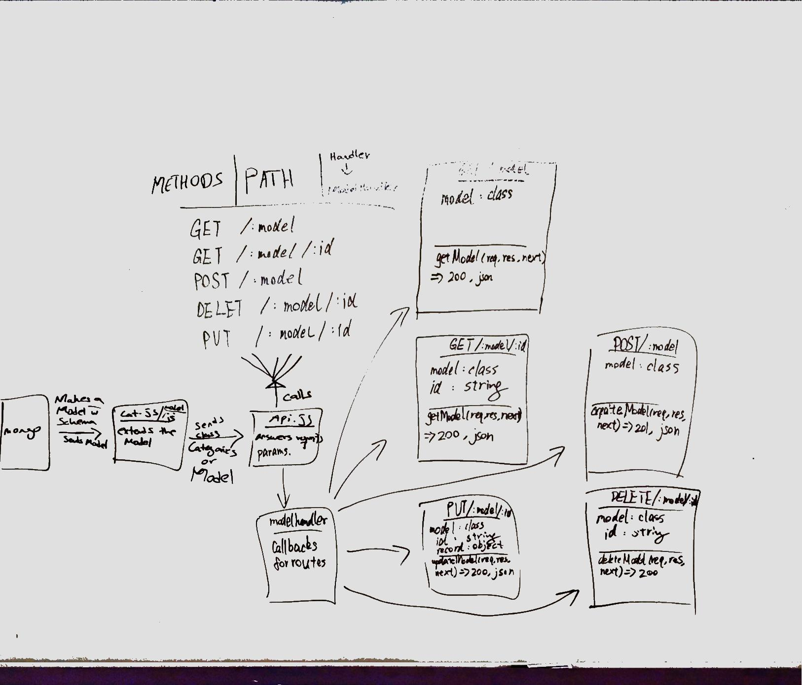

# Lab-09

### Author: Hanna Alemu

### Mongo DB URL

mongodb://localhost:27017/

### Common npm Scripts
 "lint": "eslint \"**/*.js\"",  
   "start": "node index.js",  
   "test": "jest --verbose --coverage",  
   "test-watch": "jest --watchAll --verbose --coverage",  
   "jsdoc": "jsdoc -c ./docs/config/jsdoc.config.json",  
   "startDB": "mkdir -p ./.db && mongod --dbpath ./.db"

### For JS DOCS
* http://localhost:3000/docs/

### Links and Resources
* [submission PR]()
* [travis]()

#### Documentation
* [api docs](http://swagger.io) 
* [jsdoc](http://localhost:3000/docs)

### Modules
#### `modulename.js`
##### Exported Values and Methods

###### `foo(thing) -> string`
Usage Notes or examples

###### `bar(array) -> array`
Usage Notes or examples

### Setup
#### `.env` requirements
* `PORT` - 3000
* `MONGODB_URI` - URL to the running mongo instance/db

#### Running the app
* `npm start`
  * Returns a JSON object with abc in it.

* Endpoint: `/api/v1/categories`
  * Returns a JSON object with all categories in database in it.
  
* Endpoint: `/api/v1/categories:id`
  * Returns a JSON object with the specified category in database in it.
  
* Endpoint: `/api/v1/products`
  * Returns a JSON object with all products in database in it.
  
* Endpoint: `/api/v1/products:id`
  * Returns a JSON object with a product in database in it.
  
#### Tests

run npm test

#### UML

